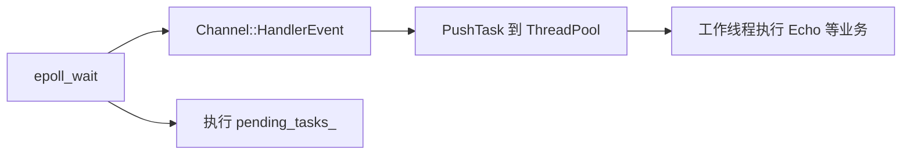
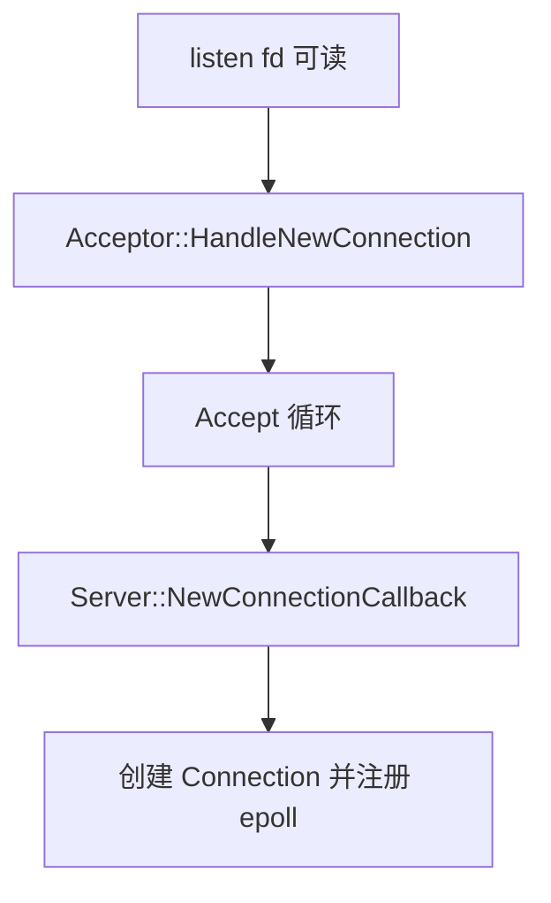
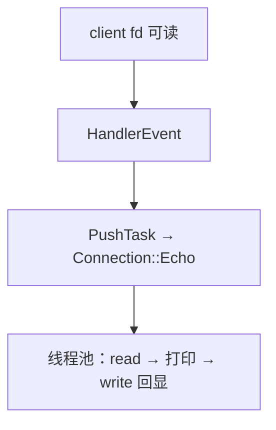

# Day 12：主从 Reactor 与线程池

本阶段目标：从 **单 Reactor + 线程池** 演进到 **主从 Reactor（One Loop Per Thread）** 架构。

监听地址：`127.0.0.1:8888`

## 编译与运行

```bash
make

./server.exe   # 终端 1：启动 echo 服务器
./client.exe   # 终端 2：输入消息测试

make test      # 线程池 benchmark（4 线程 vs 8 线程）
```

---

## 三种 Reactor 模式对比

| 模式 | 结构 | 优点 | 缺点 | 典型场景 |
|---|---|---|---|---|
| **单线程 Reactor** | 一个线程：`epoll_wait` + accept + read/write + 业务 | 实现简单，无锁 | 一个慢客户端拖死全体；CPU 单核 | 连接少、业务极轻（7-9day） |
| **多线程单 Reactor** | 一个 Reactor 线程负责 I/O 事件；业务丢进线程池 | I/O 与计算分离，实现改动小 | Reactor 仍是单点；accept/read/write 都在同一线程 | **当前 12day 代码** |
| **多线程主从 Reactor** | MainReactor 只 accept；SubReactor 各管一批连接的 I/O | I/O 并行、连接隔离好，接近 muduo | 连接迁移、跨线程回调更复杂 | 高并发 TCP 服务（muduo） |

### 为什么需要主从 Reactor

单 Reactor + 线程池里，**所有 fd 的 epoll 事件仍在同一个线程分发**。连接上千时，这一线程仍要承担全部 accept 与 read/write 调度，容易成为瓶颈。

主从 Reactor 把连接**按线程分摊**：

```text
MainReactor（主线程）
  └─ accept 新连接 → round-robin 分给某个 SubReactor

SubReactor（IO 线程 × N）
  └─ 各自 epoll_wait → 只处理分配给自己的连接 read/write/close
```

每个 SubReactor 内部仍是「单线程 Reactor」模型，线程之间通过 `QueueInLoop` / `runInLoop` 投递任务，避免跨线程直接操作 Channel。

---

## 当前实现 vs 目标架构

### 当前（12day 代码）

仍是 **一个 `EventLoop` + 内置 `ThreadPool`**，属于「多线程单 Reactor」：

```text
EventLoop 线程:
  epoll_wait → Channel::HandlerEvent()
                └─ PushTask(callback)  → 线程池执行业务（Echo 等）

pending_tasks_:
  QueueInLoop 延迟任务在本轮 epoll 结束后执行（如 connections_.erase）
```

关键改动（相对 7-9day）：

1. `Channel::HandlerReadEvent` 改为 `HandlerEvent`，**不再在 Reactor 线程里直接跑业务**。
2. `EventLoop` 持有 `ThreadPool`，`PushTask` 将回调投递到工作线程。
3. 新增 `test.cpp`，对比 4 / 8 线程池吞吐。

### 目标（主从 Reactor，待实现）

```text
MainEventLoop（主线程）
  ├─ Acceptor：listen fd 可读 → accept
  └─ 新连接 fd → 选定 SubEventLoop → QueueInLoop(注册 Connection)

SubEventLoop × N（子线程，各跑 Loop()）
  ├─ 维护分配到的 Connection / Channel
  ├─ read/write 事件在本线程处理
  └─ 断线 → RemoveChannel + 通知 Server 删连接
```

与 muduo 的对应关系：

| muduo | 本仓库（目标） |
|---|---|
| `TcpServer` + `Acceptor` | `Server` + `Acceptor` |
| `mainLoop` | `MainEventLoop` |
| `EventLoopThreadPool` | `SubEventLoop` 线程池 |
| `TcpConnection` | `Connection` |
| `runInLoop` / `queueInLoop` | `QueueInLoop`（需保证跨线程安全） |

**SubReactor 负责**：已分配连接的 I/O 维护、读写回调、关闭 fd 与 Channel 注销。  
**MainReactor 负责**：accept 与连接分发，不处理已连接客户端的数据读写。

---

## 12day 相对 10-11day 的变更

| 项目 | 10-11day | 12day |
|---|---|---|
| 线程池 | 独立 `ThreadPool` 类 | 接入 `EventLoop::PushTask` |
| 业务执行线程 | — | 线程池（默认 4 线程） |
| Reactor 线程职责 | 直接执行回调 | 只负责 epoll 分发 + 投递任务 |
| 测试 | — | `test.cpp` 线程池 benchmark |

---

## 核心流程（当前单 Reactor + 线程池）

### 1. 事件分发



### 2. 新连接（与 7-9day 相同，仍在同一 EventLoop）



### 3. 客户端消息 Echo



> 注意：Echo 在线程池执行时，同一连接的并发 read/write 需要后续加串行化（例如每连接一个 Strand，或保证回调Always 投递到同一 IO 线程）。这是演进到主从 Reactor 时要解决的问题。

---

## 目录结构

```
12day/
├── server.cpp          # 入口：单 EventLoop + Server
├── client.cpp          # 测试客户端
├── test.cpp            # ThreadPool benchmark
├── Makefile
└── lib/
    ├── event_loop.hpp  # Epoll + EventLoop + ThreadPool
    ├── threadpool.hpp  # 工作线程池
    ├── channel.hpp     # HandlerEvent → PushTask
    ├── acceptor.hpp
    ├── connection.hpp
    ├── server.hpp
    ├── socket.hpp
    ├── buffer.hpp
    └── utils.hpp
```

---

## 后续实现 checklist（主从 Reactor）

- [ ] `EventLoopThreadPool`：N 个子线程各跑一个 `EventLoop::Loop()`
- [ ] MainReactor 只保留 `Acceptor` 的 listen Channel
- [ ] `NewConnectionCallback` 中按 round-robin 选择 SubLoop，跨线程 `QueueInLoop` 注册 `Connection`
- [ ] `QueueInLoop` 加锁 + `eventfd` 唤醒，支持跨线程投递
- [ ] 连接关闭在所属 SubReactor 线程完成，`Server` 连接表更新走 `QueueInLoop` 回 Main 或加锁 map

---

## 参考

- muduo：`TcpServer` / `EventLoopThreadPool` / `One Loop Per Thread`
- 7-9day：单线程 Reactor 类职责拆分
- 10-11day：`ThreadPool` 实现与 `condition_variable` 用法
